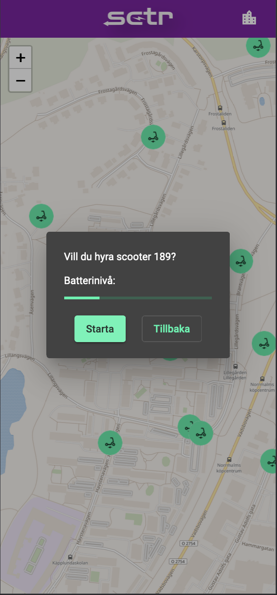
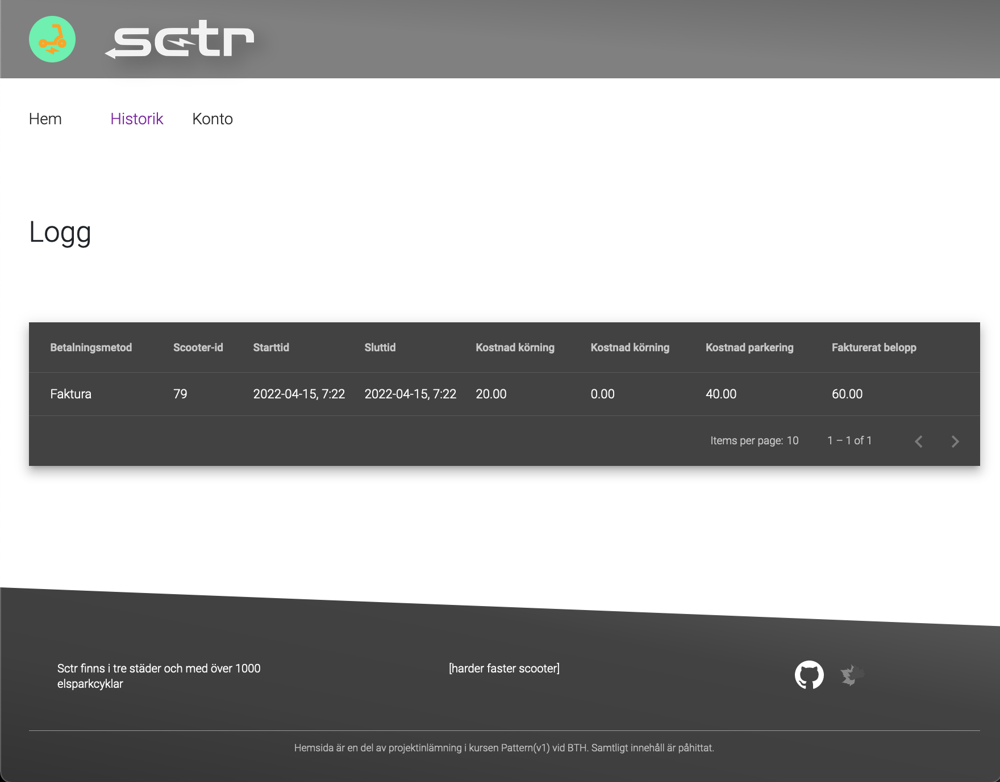
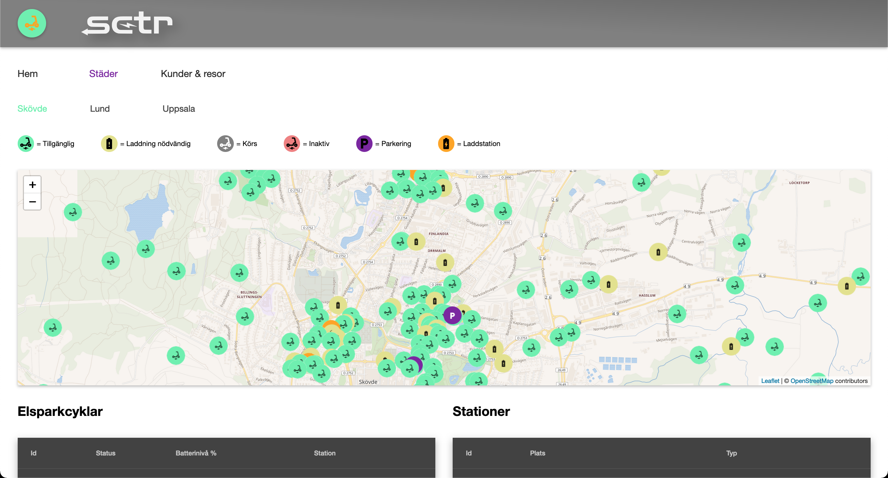

# SCTR Orchestra
This repository is part of a group project done for the ['pattern' course](https://www.bth.se/utbildning/program-och-kurser/kurser/20232/BR4QJ/) at Blekinge Institute of Technology, where we simulated a scooter hiring service. The resulting system included a database (MySQL), a backend (PHP/Laravel, using Redis) offering a RESTful API, a customer mobile-friendly app (JS/Angular), a customer desktop-friendly interface for e.g. updating payment information (JS/Angular), an administrator interface (JS/Angular), and a scooter simulator (Python, using multi-threading). All pieces of the project were containerized with Docker.

> "You've given me everything I could've asked for and more."
> 
> \- Course teacher after our final project presentation (translated from Swedish)

__Customer 'mobile app' interface__



__Customer 'desktop account management' interface__



__Administrator interface (view for checking status of scooters)__



Apart from docker setup-related files, this repository includes code from all other project-related repositories as [Git submodules](https://git-scm.com/book/en/v2/Git-Tools-Submodules). For more information on each of these, see their respective repositories:

* [pattern-db](https://github.com/joki20/pattern-db)
    + note that this submodule is nested within the pattern-backend submodule
* [pattern-backend](https://github.com/datalowe/pattern-backend)
* [pattern-customerapp](https://github.com/fahlstrm/pattern-customerapp)
* [pattern-adminweb](https://github.com/fahlstrm/pattern-adminweb)
* [pattern-customerweb](https://github.com/fahlstrm/pattern-customerweb)
* [pattern-scooter](https://github.com/jannikarlsson/pattern-scooter)

Note that, in order to include the submodules' code, when cloning the repository you need to run `git clone --recurse-submodules git@github.com:datalowe/pattern-orchestra.git`. If you accidentally ran a 'normal' `git clone` without the recursion flag, running `git submodule update --init --recursive` should help. In order to get the very latest version/commit of every submodule, you can run `git submodule foreach 'git pull'`. Keep in mind that this might take you 'out of sync' with this repository, as it has each submodule 'pinned' at a certain commit.

If you have any issues with cloning this repository with use of the SSH-based address, you might instead try `git clone --recurse-submodules https://github.com/datalowe/pattern-orchestra.git`. If even this fails for some reason, and you only want to try running the system (rather than adding new commits), you may use GitHub's web interface to select "download as ZIP", unzip, go to the resulting directory, and run `docker compose up` (see below).

## Build and run with Docker
### Pulling images from Docker Hub
If you just want to use pre-built images that you pull from Docker Hub, run `docker compose up`. Or, if you want to run in detached mode, (not 'dedicating' the terminal session to output from containers), run `docker compose -d up`; but if you do, remember that the system might need 30-60s to finish setup even after the containers are started.

This is the most time- and space-efficient method to get everything running.

To tidy up and remove all pulled images as well, run
```bash
docker-compose down --rmi all
```

(the Docker Hub images are updated with the 'update_repo_images.txt' commands)

### Building from submodules
Be aware that building images from submodules and running directly requires __a lot__ of space, about 5GB. This is mainly because the frontend applications, which use Angular and associated npm packages, run their builds inside their respctive containers when opting for this method. This method is however useful during active development since you avoid accidentally using old code and don't need to do any manual build steps on the host computer to get the latest version of everything.

```bash
cd /path/to/this/dir

# depending on your host OS, you might need/prefer to use `docker compose up` instead.
# note the '--build' flag which ensures that images are always built, rather than
# containers being run based on pre-existing, possibly outdated, images.
docker compose -f docker-compose.localbuild.yml up
docker-compose up --build
```

To bring containers down and delete them, run (after hitting 'ctrl+C'/'Cmd+C' if you ran in 'attached mode')
```bash
docker-compose down
```

If you want to tidy up and remove all built/pulled images as well, run
```bash
docker-compose down --rmi all
```

### Routes
Once all Docker containers have finished setup, you can reach the different parts of the project as follows:
* `localhost:8000`: direct access to backend (e. g. `localhost:8000/api/scooters`)
* `localhost:4201`: customer app (for hiring scooters)
* `localhost:4202`: customer 'web' interface (for tasks like reviewing previous trips)
* `localhost:4203`: administrator web interface
* `localhost:5000`: only make _a single request_ to this endpoint in order to trigger scooter simulation (after a short delay, you should be able to see changes happening in admin/customer interface maps)
